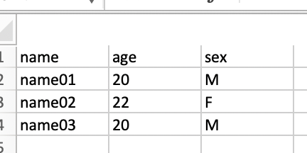
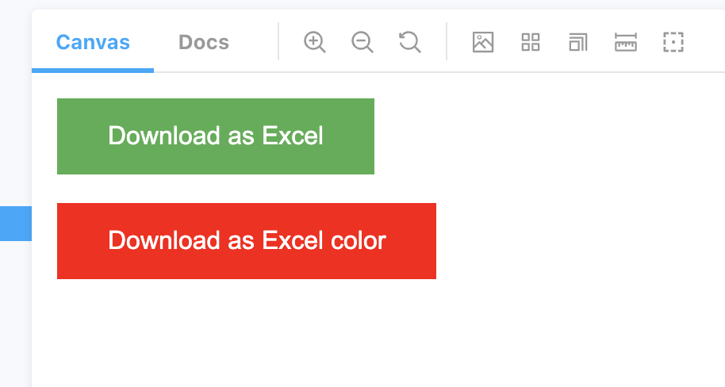

# React json to excel

[](https://nodei.co/npm/react-json-to-excel/)
[]

## Install

```
npm install react-json-to-excel --save

```

## Usage
```
Add the script file in index.html
<script src="https://cdnjs.cloudflare.com/ajax/libs/xlsx/0.16.2/xlsx.full.min.js"></script>

```

```js
import { JsonToExcel } from "react-json-to-excel";

class SmapleComponent extends Component {
  render() {
    return (
      <JsonToExcel
        title="Download as Excel"
        data={[{ test: "test" }]}
        fileName="sample-file"
        btnClassName="custom-classname"
      />
    );
  }
}
```

## Usage

```js
import { JsonToExcel } from "react-json-to-excel";
const samplejson1 = [
  { label: "C" },
  { label: "Java" },
  { label: "Go" },
  { label: "Javascript" },
  { label: "HTML" },
  { label: "CSS" },
  { label: "REACT" },
  { label: "JQUERY" }
];

const samplejson2 = [
  { name: "name01" , age:"20",sex:"M" },
  { name: "name02" , age:"22",sex:"F" }
  { name: "name03" , age:"20",sex:"M" }
];

class SmapleComponent2 extends Component {
  render() {
    return (
      <JsonToExcel
        title="Download as Excel"
        data={samplejson}
        fileName="sample-file"
      />
       <JsonToExcel
        title="Download as Excel"
        data={samplejson2}
        fileName="sample-file"
      />
    );
  }
}
```

[Example](https://github.com/maniyedidi/react-json-to-excel/tree/master/src/stories)




## PROPTYPES

| Prop         | Type   | Info                                                     |
| ------------ | ------ | -------------------------------------------------------- |
| title        | String | name of the button                                       |
| btnClassName | String | class name added to the the button for css customization |
| data         | Array  | array of objects                                         |
| fileName     | String | download file name                                       |
| btnColor     | String | color of button defatlt to #4CAF50                       |

# react-json-to-excel
